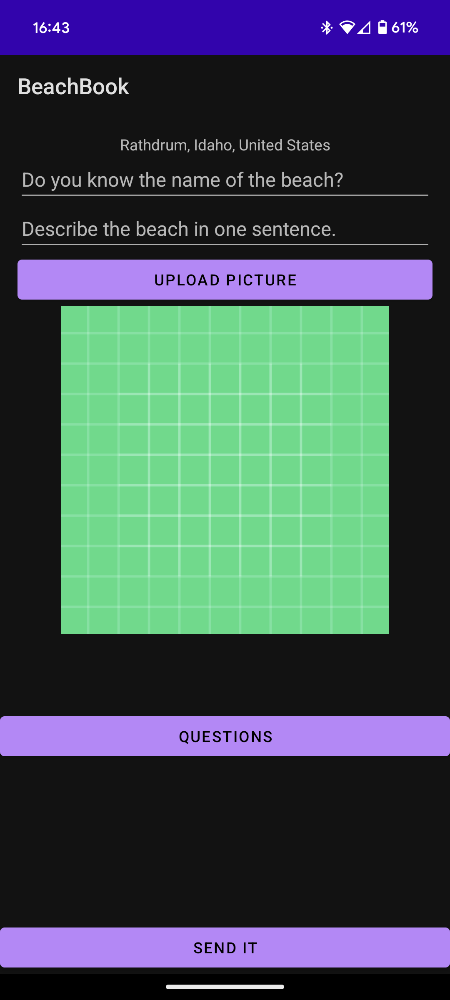
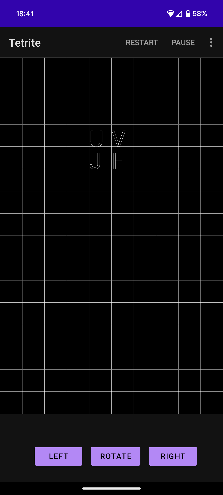

# ComputerSciencePortfolio_Chris_Ziehr
Portfolio containing computer science examples by Chris Ziehr

Welcome to my Computer Science Portfolio. Here, you will find a collection of projects showcasing my skills and interests in computer science, particularly in mobile app development and data analysis. Each project highlights my ability to blend technology and creativity to solve unique problems.

## Projects Overview

### 1. BeachBook

- [BeachBook Repository](https://github.com/ziehro/BeachBook)

<table>
  <tr>
    <td></td>
    <td></td>
    <td></td>
  </tr>
</table>

**Description**: An Android app for collecting and reviewing beach data. Users can select an existing or new beach on an interactive map and input various attributes and images.

**Technologies**: Java, Firestore, Google Cloud Functions, Map APIs, Picasso

### HailStorm

- [HailStorm Repository](https://github.com/ziehro/HailStorm)

<table>
  <tr>
    <td></td>
    <td></td>
    <td></td>
  </tr>
</table>

**Description:** An automated trading system that leverages machine learning to predict stock price movements and execute trades. The bot fetches high-frequency stock data, preprocesses it by adding technical indicators, and trains a neural network model using LSTM layers. It predicts stock price direction and automates trading decisions. The system integrates with Firebase Firestore for data storage and logging, and uses the Alpaca API for executing trades.

**Technologies:** Python, TensorFlow, Keras, Firebase Firestore, Alpaca API, YFinance, Pandas, NumPy, Scikit-Learn, Matplotlib, Seaborn, Google Cloud Functions, Google Cloud Logging

### HotFacts
An innovative Android app that uses OpenAI's technologies to create informative YouTube videos based on user-provided keywords.

- [HotFacts Repository](https://github.com/ziehro/HotFacts)

<table>
  <tr>
    <td></td>
    <td></td>
    <td></td>
    <td></td>
  </tr>
</table>

**Description**: An Android app that generates YouTube videos with facts based on a single word or phrase. It utilizes OpenAI's ChatGPT and Dall-E for content creation.

**Technologies**: ChatGPT, Dall-E, OpenAI API, TTS, Cloud Secrets

### Gaia
An Android app creating a verbal interaction with ChatGPT, providing users a conversational experience.

- [Gaia Repository](https://github.com/ziehro/Chet)

<table>
  <tr>
    <td></td>
    <td></td>
    <td></td>
  </tr>
</table>

**Description**: An Android app that facilitates verbal conversations with ChatGPT, featuring voice recognition and text-to-speech functionality.

**Technologies**: OpenAI API, Java, TTS, Voice Recognition

### LuckyDay
A unique app correlating personal events with lunar phases to discover the user's luckiest days.

- [LuckyDay Repository](https://github.com/ziehro/LuckyDay)

<table>
  <tr>
    <td></td>
    <td></td>
    <td></td>
  </tr>
</table>

**Description**: An app for tracking and correlating personal events with lunar phases to discover one's 'Lucky Day'.

**Technologies**: Java, MPAndroidChart, Picasso, Apache

### Tetrite
A Tetris-like game with a twist: filled blocks reveal letters to form words.

- [Tetrite Repository](https://github.com/ziehro/Tetrite)

<table>
  <tr>
    <td></td>
    <td></td>
    <td></td>
  </tr>
</table>

**Description**: A Tetris-like Android game where the tetrominoes are filled with letters, challenging players to find words as they complete lines.

**Technologies**: Java, Espresso

## About Me

I am a data science enthusiast with a passion for uncovering insights from complex datasets and translating them into actionable strategies. My background spans various disciplines, and I hold a Data Analyst Certificate from Google. Currently, I am completing my Machine Learning course through Stanford Online. I am constantly seeking to learn new techniques and tools in the field of data science.

## Connect with Me

- Email: [ziehro@gmail.com](mailto:ziehro@gmail.com)
- Web: [driftwest.xyz](https://driftwest.xyz)
- Blog: [Visit my blog for more insights and tutorials.](https://driftwest.xyz/blog)

Thank you for visiting my portfolio!
