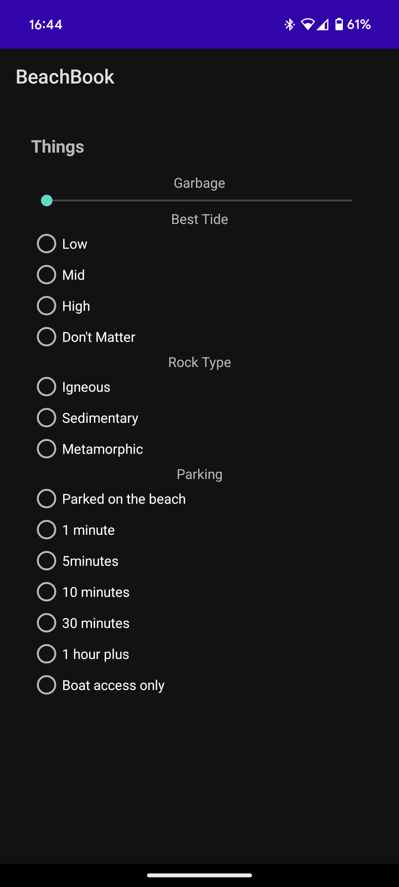
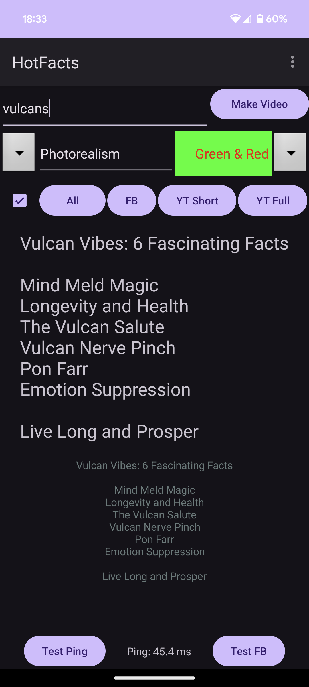

# ComputerSciencePortfolio_Chris_Ziehr
Portfolio containing computer science examples by Chris Ziehr

Welcome to my Computer Science Portfolio. Here, you will find a collection of projects showcasing my skills and interests in computer science, particularly in mobile app development and data analysis. Each project highlights my ability to blend technology and creativity to solve unique problems.

## Projects Overview

### MyBeachBook
A sophisticated Flutter mobile application that creates a crowd-sourced "ground truth" database of coastal locations through data amalgamation and interactive visualization.

- [MyBeachBook Repository](https://github.com/ziehro/mybeachbook)

<table>
  <tr>
    <td></td>
    <td></td>
    <td></td>
  </tr>
</table>

**Description**: MyBeachBook aggregates multiple user contributions per beach to establish consensus "ground truth" data about coastal environments. Users document beaches through detailed multi-page forms covering flora, fauna, driftwood, and composition metrics. Each contribution is processed by Firebase Cloud Functions that calculate weighted averages, vote on categorical choices, and build comprehensive beach profiles. The app features an interactive heatmap system overlaying 30+ metrics on Google Maps with color-gradient circles that dynamically resize based on zoom level, allowing users to visualize patterns like sand coverage, driftwood availability, or marine life abundance across regions. AI integration includes GPT-4 generated educational descriptions, DALL-E 3 watermarked images, and ML Kit-powered species identification. The system prevents duplicates through UUID tracking and geohash-based location verification, while a migration service consolidates historical data into the unified beach database. Additional features include offline sync, multiple map styles, long-press metric explanations, and discovery scavenger hunts.

**Technologies**: Flutter, Firebase (Firestore, Storage, Auth, Cloud Functions), OpenAI API (GPT-4, DALL-E 3), Google Maps API, ML Kit, iNaturalist API, Geohashing, Dart

### Caloz
An innovative Android calculator with a unique twist: calculate with letters instead of numbers using custom alphabets.

- [Caloz Repository](https://github.com/ziehro/myzeno)
- [Google Play Store](https://play.google.com/store/apps/details?id=com.ziehro.zeno)

<table>
  <tr>
    <td></td>
    <td></td>
    <td></td>
  </tr>
</table>

**Description**: A unique Android calculator that allows users to perform mathematical operations using custom letter-based number systems. Create your own alphabets where each letter represents a number, enabling creative calculation methods. Perfect for encryption, gaming, or just having fun with math in a new way.

**Technologies**: Java, Android SDK

### HailStorm

- [HailStorm Repository](https://github.com/ziehro/HailStorm)

<table>
  <tr>
    <td></td>
    <td></td>
    <td></td>
  </tr>
</table>

**Description:** An automated trading system that leverages machine learning to predict stock price movements and execute trades. The bot fetches high-frequency stock data, preprocesses it by adding technical indicators, and trains a neural network model using LSTM layers. It predicts stock price direction and automates trading decisions. The system integrates with Firebase Firestore for data storage and logging, and uses the Alpaca API for executing trades.

**Technologies:** Python, TensorFlow, Keras, Firebase Firestore, Alpaca API, YFinance, Pandas, NumPy, Scikit-Learn, Matplotlib, Seaborn, Google Cloud Functions, Google Cloud Logging

### HotFacts
An innovative Android app that uses OpenAI's technologies to create informative YouTube videos based on user-provided keywords.

- [HotFacts Repository](https://github.com/ziehro/HotFacts)

<table>
  <tr>
    <td></td>
    <td></td>
    <td></td>
    <td></td>
  </tr>
</table>

**Description**: An Android app that generates YouTube videos with facts based on a single word or phrase. It utilizes OpenAI's ChatGPT and Dall-E for content creation.

**Technologies**: ChatGPT, Dall-E, OpenAI API, TTS, Cloud Secrets

### LuckyDay
A unique app correlating personal events with lunar phases to discover the user's luckiest days.

- [LuckyDay Repository](https://github.com/ziehro/LuckyDay)

<table>
  <tr>
    <td></td>
    <td></td>
    <td></td>
  </tr>
</table>

**Description**: An app for tracking and correlating personal events with lunar phases to discover one's 'Lucky Day'.

**Technologies**: Java, MPAndroidChart, Picasso, Apache

## About Me

I am a data science enthusiast with a passion for uncovering insights from complex datasets and translating them into actionable strategies. My background spans various disciplines, and I hold a Data Analyst Certificate from Google. Currently, I am completing my Machine Learning course through Stanford Online. I am constantly seeking to learn new techniques and tools in the field of data science.

## Connect with Me

- Email: [ziehro@gmail.com](mailto:ziehro@gmail.com)
- Web: [driftwest.xyz](https://driftwest.xyz)
- Blog: [Visit my blog for more insights and tutorials.](https://driftwest.xyz/blog)

Thank you for visiting my portfolio!
