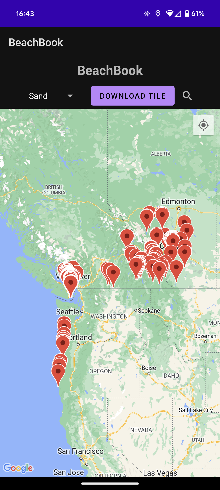

# ComputerSciencePortfolio_Chris_Ziehr
Portfolio containing computer science examples by Chris Ziehr

Welcome to my Computer Science Portfolio. Here, you will find a collection of projects showcasing my skills and interests in computer science, particularly in mobile app development and data analysis. Each project highlights my ability to blend technology and creativity to solve unique problems.

## Projects

### BeachBook
An Android application for beach enthusiasts to collect and share data about their favorite beaches.

**Technologies:** Java, Firestore, Google Cloud Functions, Google Maps API, Picasso

- [BeachBook Repository](https://github.com/ziehro/BeachBook)
- 
- 
- 

### HotFacts
An innovative Android app that uses OpenAI's technologies to create informative YouTube videos based on user-provided keywords.

**Technologies:** ChatGPT, DALL-E, OpenAI API, TTS, Cloud Secrets

- [HotFacts Repository](https://github.com/ziehro/HotFacts)
- 
- 
- 

### Gaia
An Android app creating a verbal interaction with ChatGPT, providing users a conversational experience.

**Technologies:** OpenAI API, Java, TTS, Voice Recognition

- [Chet Repository](https://github.com/ziehro/Chet)
- 
- 
- 

### LuckyDay
A unique app correlating personal events with lunar phases to discover the user's luckiest days.

**Technologies:** Java, MPAndroidChart, Picasso, Apache

- [LuckyDay Repository](https://github.com/ziehro/LuckyDay)
- 
- 
- 

### Tetrite
A Tetris-like game with a twist: filled blocks reveal letters to form words.

**Technologies:** Java, Espresso

- [Tetrite Repository](https://github.com/ziehro/Tetrite)
- 
- 
- 

## About Me

I am a data science enthusiast with a passion for uncovering insights from complex datasets and translating them into actionable strategies. My background spans various disciplines, and I hold a Data Analyst Certificate from Google. Currently, I am completing my Machine Learning course through Stanford Online. I am constantly seeking to learn new techniques and tools in the field of data science.

## Connect with Me

- Email: [ziehro@gmail.com](mailto:ziehro@gmail.com)
- Web: [driftwest.xyz](https://driftwest.xyz)
- Blog: [Visit my blog for more insights and tutorials.](https://driftwest.xyz/blog)

Thank you for visiting my portfolio!
